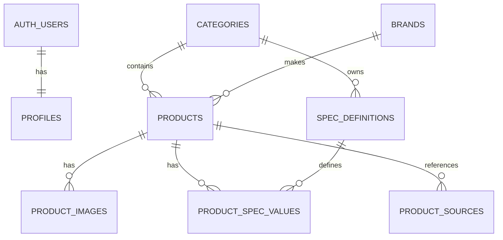

# การออกแบบฐานข้อมูล SpecCompare

## ความสัมพันธ์หลัก

## หน้าที่ของแต่ละตาราง

### `categories`
เก็บประเภทสินค้า เช่น CPU, GPU และ SSD

### `brands`
เก็บยี่ห้อสินค้า

### `products`
เก็บข้อมูลกลางที่ทุกหมวดใช้ร่วมกัน เช่น ชื่อ รุ่น ราคา สถานะ และวันที่ตรวจสอบข้อมูล

### `product_images`
เก็บ path ของรูปสินค้าใน Supabase Storage รองรับหลายรูปและกำหนดรูปหลักได้หนึ่งรูป

### `spec_definitions`
กำหนดช่องสเปกของแต่ละหมวด เช่น CPU มี `cores` ส่วน SSD มี `sequential_read_mbps`

ฟิลด์ `compare_direction` ใช้สร้างตารางเปรียบเทียบ:

- `higher_better` ค่ามากกว่าดีกว่า
- `lower_better` ค่าน้อยกว่าดีกว่า
- `neutral` แสดงข้อมูลโดยไม่ตัดสินผู้ชนะ

### `product_spec_values`
เก็บค่าจริงของสเปกแต่ละสินค้า แยกชนิดเป็นตัวเลข ข้อความ และ Boolean เพื่อให้ค้นหา กรอง และเปรียบเทียบได้ถูกต้อง

### `product_sources`
เก็บแหล่งข้อมูลและวันที่ตรวจสอบ ช่วยเพิ่มความน่าเชื่อถือ

### `product_catalog`
เป็น View สำหรับอ่านข้อมูลสินค้า รูป และสเปกในคำสั่งเดียว เหมาะสำหรับหน้ารวมสินค้าและหน้ารายละเอียด

## เหตุผลที่ไม่เก็บสเปกทั้งหมดเป็น JSON อย่างเดียว

JSON เพิ่มช่องใหม่ได้ง่าย แต่ค้นหา กรอง และจัดอันดับตัวเลขได้ยากกว่า โครงสร้างนี้จึงใช้ `spec_definitions` และ `product_spec_values` เพื่อรองรับสเปกหลายหมวด โดยยังคงตรวจสอบชนิดข้อมูลได้
